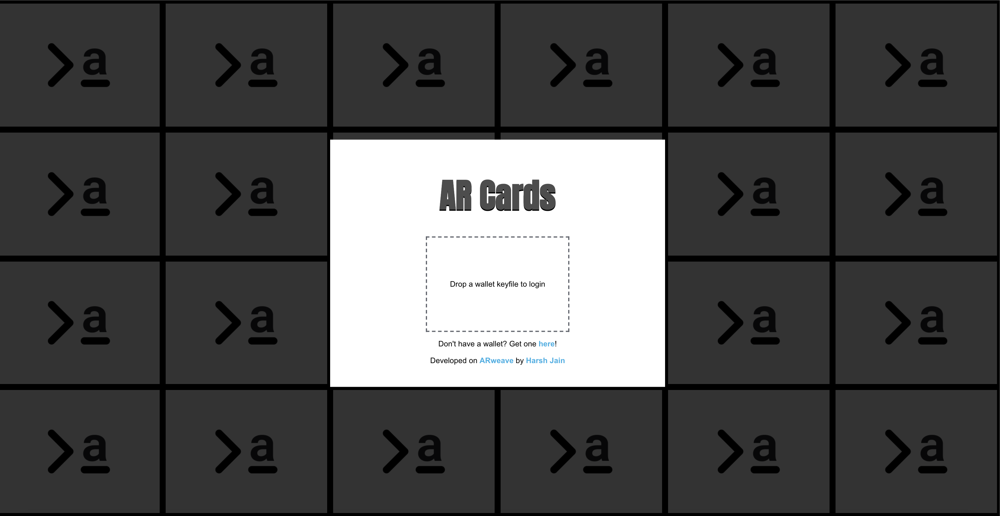
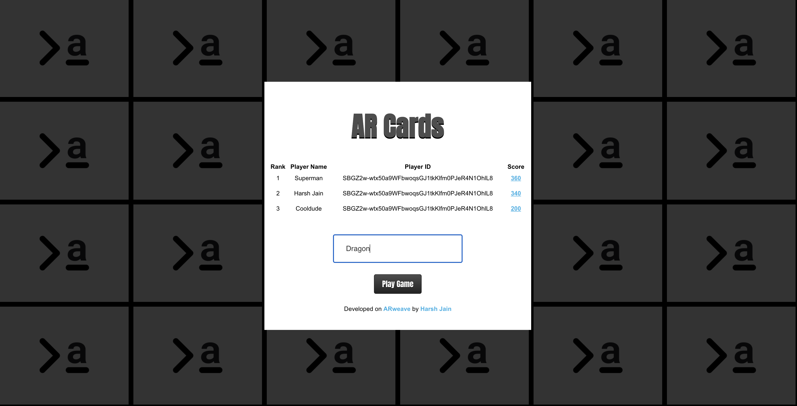
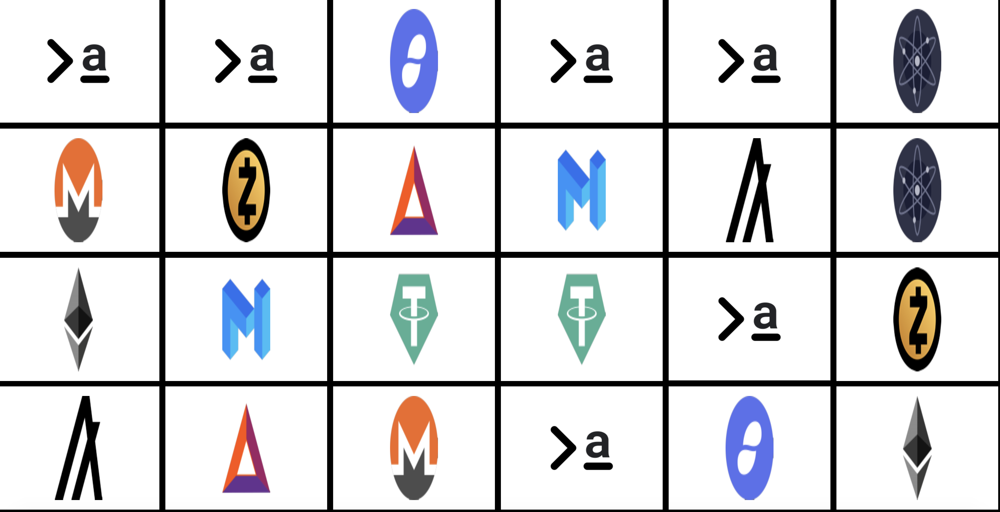
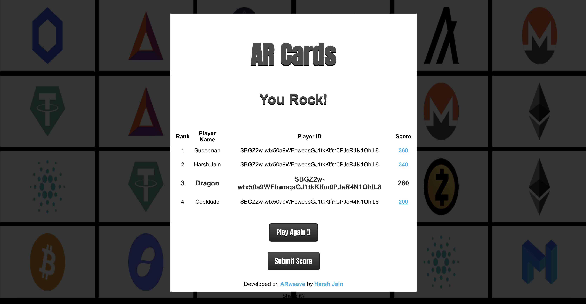

## ARweave Cards

This permaweb is a cards matching app with 24 tiles and 12 different cryptocurrency logos. Player needs arweave wallet for playing. And funds are only required if he wants to submit the scores to arweave blockchain, which is at minimal cost. Play or test the app [here](https://arweave.net/oi7GgG_BiDOOCX85jdgK1w06iEyTy0ftraMs7Qr6MLM). After completing the game you will see your score, you can submit to blockchain and also share on twitter , facebook and google.

> Link: https://arweave.net/oi7GgG_BiDOOCX85jdgK1w06iEyTy0ftraMs7Qr6MLM

## Interface (UX and UI)

#### Entry point

#### Player enters name

#### Crypto Card game interface

#### Leaderboard

